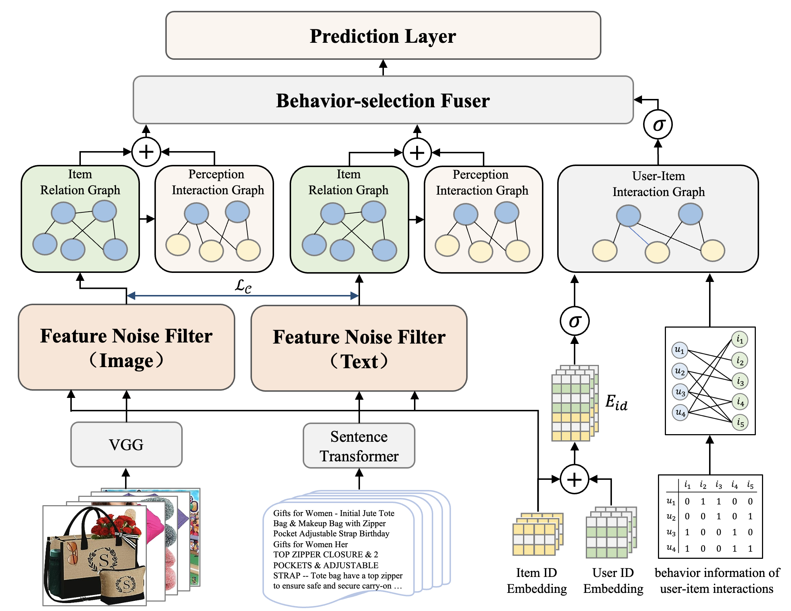

# FMGCE: Feature-filter and Multi-Graph Convolutional Encoders for Multimodal Recommendation


## Introduction

The overall structure of the Feature-filter and Multi-Graph Convolutional Encoder (FMGCE), proposed by us is shown in this Figure.



## Enviroment Requirement
- python 3.9
- lmdb 1.4.1
- matplotlib 3.8.2
- numpy 1.23.5
- pandas 2.1.3
- PyYAML 6.0.1
- scipy 1.11.4
- torch 1.12.0
- torch_scatter 2.1.2
- torchvision 0.13.0

## Dataset

Download from Google Drive: [Amazon Pre-Trained Datasets](https://drive.google.com/drive/folders/13cBy1EA_saTUuXxVllKgtfci2A09jyaG)

Raw datasets can be accessed at [Amazon product data](http://jmcauley.ucsd.edu/data/amazon/links.html)

## Training

For academic security reasons, FMGCE's code has not been officially made public yet.

  ```
  cd ./src
  python main.py
  ```

## Acknowledgement
The structure of this code is  based on [MMRec](https://arxiv.org/abs/2302.03497). Thank for their work.
